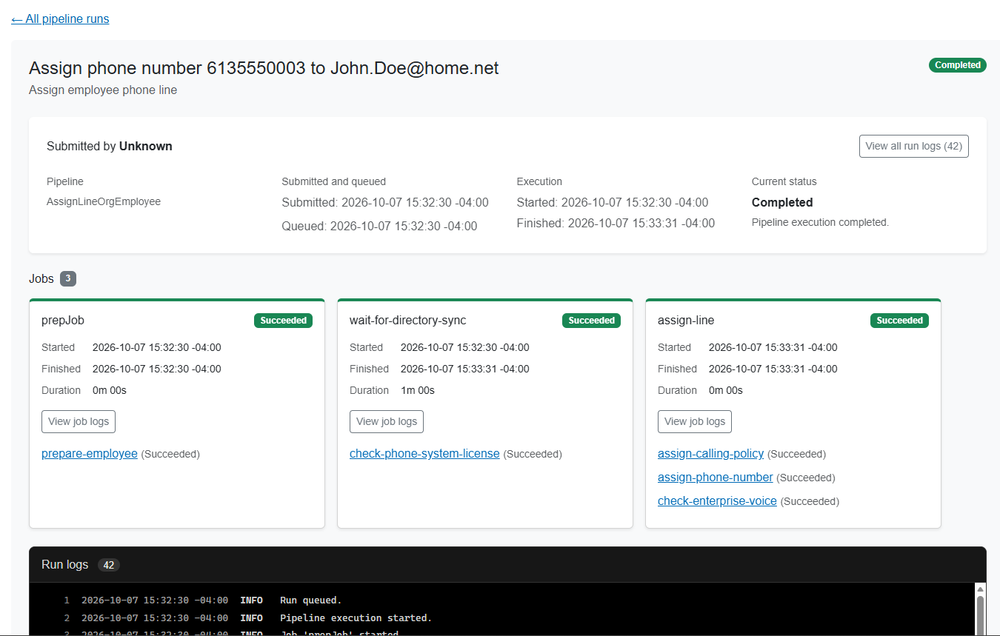
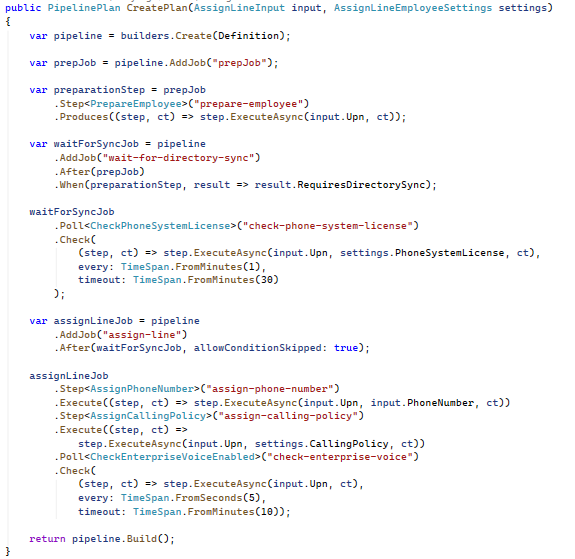
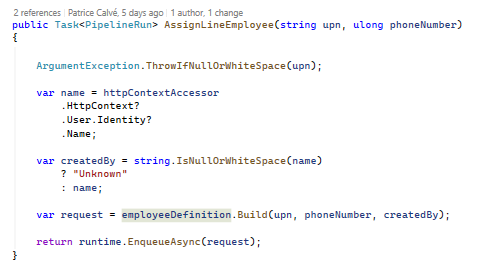
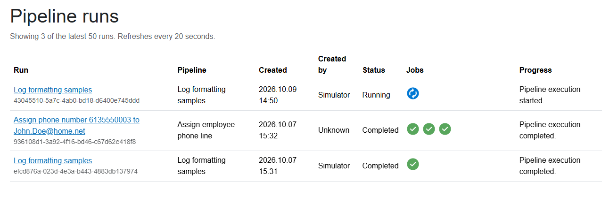
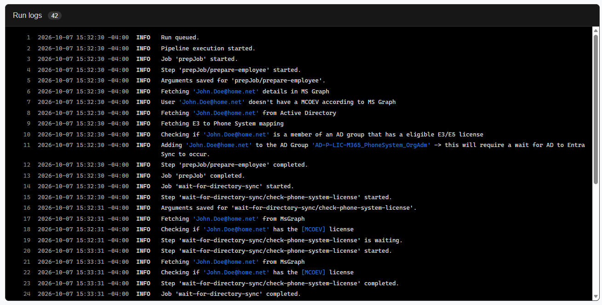

# Patware.Pipeline

## Your tasks.  Our orchestrator. Every run in view

**Workflow orchestration for .NET, with a Blazor UI and logs for every run.**

Connect your existing C# services into workflows with dependencies, conditions,
and polling. Run them in your application, follow their progress, and see
exactly what happened inside each execution.



*One employee phone-line request, from preparation through directory synchronization
to assignment—with its execution history in one place.*

[Get started](#get-started) ·
[Connect your tasks](#connect-the-tasks-you-already-have) ·
[Explore the UI](#see-whats-running-and-what-happened) ·
[Run the demo](#try-the-demo) ·
[Documentation](docs/index.md)

## From application code to visible workflows

- **Start with `AddPipeline()`.** Register the runtime in `Program.cs`.
  In-memory storage and a background worker are included.
- **Use your existing services.** Compose dependency-injected methods into
  steps. Describe their order, pass typed results, and wait for external
  systems when necessary.
- **Give your application a workflow UI.** Blazor pages show recent runs,
  execution details, job and step status, and retry controls.
- **Keep logs with the work they describe.** Inspect messages for an entire
  run, a particular job, or an individual step, with severity and ANSI formatting.

Pipeline is for application workflows such as provisioning accounts, assigning
services, coordinating integrations, and processing requests that involve
several dependent operations.

## Get started

Pipeline targets **.NET 10**.

In an application using the .NET Generic Host, add the runtime package:

```shell
dotnet add package Patware.Pipeline.Runtime
```

Register Pipeline in `Program.cs`:

```csharp
using Pipeline.Runtime;

builder.Services.AddPipeline();
```

That registration supplies in-memory persistence and the built-in background
worker. Start the application host to process queued runs.

### Submit your first run

The runtime includes a log-formatting demonstration pipeline, so you can try
submission and execution before defining your own workflow.

The following is a complete `Program.cs` for a .NET 10 console application
referencing `Patware.Pipeline.Runtime` and `Microsoft.Extensions.Hosting`:

```csharp
using Microsoft.Extensions.DependencyInjection;
using Microsoft.Extensions.Hosting;
using Pipeline.Core.Pipelines;
using Pipeline.Runtime;

var builder = Host.CreateApplicationBuilder(args);

builder.Services.AddPipeline();

using var host = builder.Build();

await host.StartAsync();

using (var scope = host.Services.CreateScope())
{
    var definition = scope.ServiceProvider
        .GetRequiredService<LogFormattingPipeline>();

    var runtime = scope.ServiceProvider
        .GetRequiredService<IPipelineRuntime>();

    var run = await runtime.EnqueueAsync(
        definition.Build(createdBy: "quick-start"));

    Console.WriteLine($"Queued pipeline run: {run.Id}");
}

await host.WaitForShutdownAsync();
```

The host remains running until you stop it. In-memory history lasts for the
lifetime of that host.

Want to see the execution in your browser? Run the
[Blazor demo](#try-the-demo), or follow the
[Blazor integration guide](src/Pipeline.Blazor/README.md).

## Connect the tasks you already have

Consider assigning an employee a phone line:

1. Prepare the employee and determine whether directory synchronization is needed.
2. Wait for the required license to appear.
3. Assign the phone number and calling policy.
4. Verify that enterprise voice is enabled.

Each action stays in its own service. The pipeline definition describes how
those actions work together.

This excerpt from the included example connects preparation to a conditional
polling job:

```csharp
var pipeline = builders.Create(Definition);

var prepJob = pipeline.AddJob("prepJob");

var preparationStep = prepJob
    .Step<PrepareEmployee>("prepare-employee")
    .Produces((step, ct) => step.ExecuteAsync(input.Upn, ct));

var waitForSyncJob = pipeline
    .AddJob("wait-for-directory-sync")
    .After(prepJob)
    .When(preparationStep, result => result.RequiresDirectorySync);

waitForSyncJob
    .Poll<CheckPhoneSystemLicense>("check-phone-system-license")
    .Check(
        (step, ct) => step.ExecuteAsync(
            input.Upn,
            settings.PhoneSystemLicense,
            ct),
        every: TimeSpan.FromMinutes(1),
        timeout: TimeSpan.FromMinutes(30));
```

The preparation result determines whether synchronization is needed. The polling
step checks for the license until it succeeds or reaches its timeout.

The next job declares its dependency and invokes the assignment services:

```csharp
var assignLineJob = pipeline
    .AddJob("assign-line")
    .After(waitForSyncJob, allowConditionSkipped: true);

assignLineJob
    .Step<AssignPhoneNumber>("assign-phone-number")
    .Execute((step, ct) =>
        step.ExecuteAsync(input.Upn, input.PhoneNumber, ct))
    .Step<AssignCallingPolicy>("assign-calling-policy")
    .Execute((step, ct) =>
        step.ExecuteAsync(input.Upn, settings.CallingPolicy, ct));
```

`allowConditionSkipped: true` lets assignment continue when preparation
determines that the synchronization job is unnecessary.

Your methods contain the business logic. The definition makes their
dependencies and execution order explicit.

### Submit work from your application

With the definition and runtime injected into an application service, submission
is two lines:

```csharp
var request = employeeDefinition.Build(upn, phoneNumber, createdBy);

return runtime.EnqueueAsync(request);
```

For custom workflows, register the definition, its step services, and an
`IPipelineDefinitionRegistration`. That registration lets the runtime reconstruct
the correct definition version from stored inputs and settings.

See the complete
[definition](src/Pipeline.Web/Pipelines/AssignLineEmployeeDefinition.cs),
[registration](src/Pipeline.Web/Pipelines/AssignLineEmployeeRegistration.cs),
and [calling service](src/Pipeline.Web/Services/MyPipelines.cs).

<details>
<summary>See the definition and calling code in the sample application</summary>

### Pipeline definition



### Application service



</details>

## See what’s running—and what happened

The Blazor UI brings workflow execution into your application.

### An overview of your runs

See recent submissions, who initiated them, their current status, and the status
of each job. Open a run to investigate its execution.



### Follow a run down to its steps

The run-detail page shown above brings together:

- The request title and pipeline identity.
- Submission, start, and finish times.
- Overall status and status messages.
- Jobs and their individual steps.
- Links to the corresponding logs.

For failed runs, **Re-run from failure** supports resuming unfinished work while
preserving successful steps, their outputs, and log history.

The UI is supplied by `Patware.Pipeline.Blazor`. Integrate its pages with
`AddPipelinePages()` and `PipelineRouter` while retaining your application's
layout and navigation.

[Set up the Blazor UI →](src/Pipeline.Blazor/README.md)

## Logs that belong to the run

When a workflow waits for a license, assigns a number, or encounters an error,
its messages belong beside that execution.

Pipeline combines execution messages with the messages your steps write through
`IPipelineStepLogger`. View the whole run, or narrow the log to a job or step.



Timestamps, severity, and ANSI formatting help distinguish events and highlight
the values that matter: the account being updated, the resource being checked,
or the result returned by an external system.

Logs remain associated with the run, so investigating one request does not
require sorting through messages from every other workflow.

## Choose how your workflows run

Start with the default registration. Add durable storage or Hangfire processing
when your application needs them.

| Storage | Processing | Configuration inside `AddPipeline` |
| --- | --- | --- |
| In memory | Built-in worker | No options required |
| In memory | Hangfire | `options.UseHangfire()` |
| SQL Server | Built-in worker | `options.UseSqlServer(connectionString)` |
| SQL Server | Hangfire | `options.UseSqlServer(connectionString).UseHangfire()` |

For example, with the persistence and Hangfire packages installed:

```csharp
using Pipeline.Hangfire;
using Pipeline.Persistence.EntityFrameworkCore;
using Pipeline.Runtime;

var connectionString = builder.Configuration.GetConnectionString("Pipeline")
    ?? throw new InvalidOperationException(
        "Connection string 'Pipeline' is missing.");

builder.Services.AddPipeline(options =>
{
    options
        .UseSqlServer(connectionString)
        .UseHangfire();
});
```

Choose one `AddPipeline` registration for your host. Built-in steps and the
log-formatting definition are registered automatically.

SQL Server persistence applies the library's migrations at startup. Keep
historical definition versions registered when persisted runs still depend on them.

The monitoring UI can also run in a separate application, using an HTTP client
to query an executor host.

[Runtime configuration](src/Pipeline.Runtime/README.md) ·
[SQL Server persistence](src/Pipeline.Persistence.EntityFrameworkCore/README.md) ·
[Hangfire processing](src/Pipeline.Hangfire/README.md) ·
[Distributed hosting](docs/architecture/DISTRIBUTED-HOSTING.md)

## Packages

Install the parts your application needs. Runtime brings in Core and Contracts;
Blazor can work with either local or remote monitoring.

| Package | Purpose |
| --- | --- |
| [Patware.Pipeline.Runtime](src/Pipeline.Runtime/README.md) | Dependency injection, submission, execution, in-memory storage, and the built-in worker. |
| [Patware.Pipeline.Blazor](src/Pipeline.Blazor/README.md) | Run overview, execution details, retry controls, and formatted logs. |
| [Patware.Pipeline.Core](src/Pipeline.Core/README.md) | Fluent workflow definitions, dependencies, conditions, typed outputs, and polling. |
| [Patware.Pipeline.Contracts](src/Pipeline.Contracts/README.md) | Monitoring interfaces and display models. |
| [Patware.Pipeline.Persistence.EntityFrameworkCore](src/Pipeline.Persistence.EntityFrameworkCore/README.md) | SQL Server persistence through Entity Framework Core. |
| [Patware.Pipeline.Hangfire](src/Pipeline.Hangfire/README.md) | Hangfire processing and scheduling integration. |
| [Patware.Pipeline.AspNetCore](src/Pipeline.AspNetCore/README.md) | HTTP endpoints for monitoring and retry requests. |
| [Patware.Pipeline.HttpClient](src/Pipeline.HttpClient/README.md) | Remote monitoring client for a separate UI host. |

The public API is currently pre-1.0. See the
[changelog](CHANGELOG.md) for release details and upgrade instructions.

## Try the demo

### Pipeline.Web

The all-in-one Blazor sample demonstrates the employee phone-line workflow
shown in the screenshots. It includes simulated directory, licensing, and
telephony services so you can follow each stage.

To run it:

1. Install the .NET 10 SDK and make a SQL Server instance available.
2. Set `ConnectionStrings__Pipeline` to your SQL Server connection string.
3. Start the sample:

   ```shell
   dotnet run --project src/Pipeline.Web --launch-profile https
   ```

4. Open the URL printed by the host.
5. Visit `/simulator` to submit work, then `/pipeline` to follow it.

The sample uses SQL Server persistence and Hangfire. Its database identity needs
permission to create and update their storage objects.

[Explore the sample →](src/Pipeline.Web)

### Separate frontend and backend

The Aspire sample demonstrates a Blazor frontend communicating with a separate
executor API. It also includes Kubernetes configuration for exploring multiple
replicas and recovery.

[Run the Aspire sample →](src/AspireApp1/README.md)

For multiple executors, use shared durable storage and compatible definition
versions. External side effects can repeat during recovery; design those actions
to tolerate retries. See the
[distributed-hosting guide](docs/architecture/DISTRIBUTED-HOSTING.md)
for the execution guarantees and deployment considerations.

## Development

With the .NET SDK selected by `global.json` and PowerShell 7 or later:

```powershell
$packages = ./Build.ps1
./eng/Test-Packages.ps1 -PackageDirectory $packages
```

This builds the libraries, runs the library test suites, packs the packages,
and validates them with an isolated consumer smoke test.

[Documentation](docs/index.md) ·
[Contributing](CONTRIBUTING.md) ·
[Tests](tests/README.md) ·
[Release notes](CHANGELOG.md) ·
[Support](SUPPORT.md)

Found a problem? Open an issue with the workflow you were building, the expected
behavior, and a minimal reproduction. For vulnerabilities, follow the
[security policy](SECURITY.md).

## License

[MIT](LICENSE)
