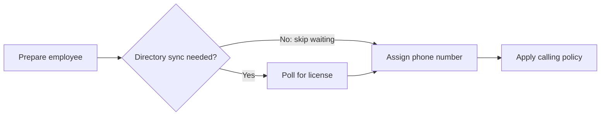
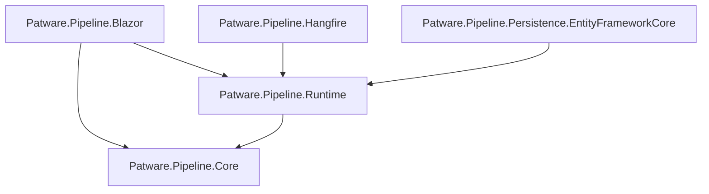

# Pipeline

### Turn “it’s still running” into “here’s exactly where it is.”

**Composable workflows for .NET. Written in C#. Visible in Blazor.**

Real business workflows have dependencies, slow external systems, conditional steps, and the occasional spectacular failure. Pipeline gives those workflows a shape: define the work, connect the jobs, wait for the right conditions, and follow each run from submission to completion.

Keep your business logic in ordinary dependency-injected services. Let Pipeline handle the orchestration around it.

[See the workflow](#a-workflow-you-can-read) · [Get started](#your-first-run) · [Choose your libraries](#one-workflow-stack-pick-the-pieces-you-need) · [Explore the demo](#see-it-in-action)

<!-- SCREENSHOT: Add a wide run-detail screenshot here. Show job cards, a polling step, and a few colorful log lines. Suggested asset: doc/images/pipeline-run.png. -->

## Business processes deserve better than a mystery background task

Provision an employee. Wait for directory synchronization. Assign a phone number. Apply a policy. Verify the change actually took effect.

That’s a workflow. And when step four fails, you want to know what succeeded, what failed, and what can run next.

Pipeline brings the execution story into your application:

- **Express the order.** Connect jobs with `.After(...)` and keep steps inside each job sequential.
- **Make results useful.** Produce typed outputs and pass them into later steps with `.Using(...)`.
- **Branch on what happened.** Gate jobs with `.When(...)` and explicitly allow downstream work after a condition skips a job.
- **Wait with a plan.** Poll external systems with a defined interval and timeout.
- **Resume unfinished work.** Retry a failed run while preserving successful steps, their outputs, and log history.
- **See the whole run.** Blazor pages show status, job and step progress, and logs filtered down to the work you’re investigating.

**You write the business action. Pipeline connects it to everything that happens before and after.**

## A workflow you can read

This excerpt comes from the [employee phone-line provisioning demo](src/Pipeline.Web/Pipelines/AssignLineEmployeeDefinition.cs). The action services contain the business logic; the graph makes the process readable.

```csharp
var pipeline = builders.Create(Definition);

var prepare = pipeline.AddJob("prepare");

var preparation = prepare
    .Step<PrepareEmployee>("prepare-employee")
    .Produces((step, ct) => step.ExecuteAsync(input.Upn, ct));

var waitForSync = pipeline
    .AddJob("wait-for-directory-sync")
    .After(prepare)
    .When(preparation, result => result.RequiresDirectorySync);

waitForSync
    .Poll<CheckPhoneSystemLicense>("check-license")
    .Check(
        (step, ct) => step.ExecuteAsync(
            input.Upn, settings.PhoneSystemLicense, ct),
        every: TimeSpan.FromMinutes(1),
        timeout: TimeSpan.FromMinutes(30));

pipeline
    .AddJob("assign-line")
    .After(waitForSync, allowConditionSkipped: true)
    .Step<AssignPhoneNumber>("assign-number")
    .Execute((step, ct) =>
        step.ExecuteAsync(input.Upn, input.PhoneNumber, ct))
    .Step<AssignCallingPolicy>("assign-policy")
    .Execute((step, ct) =>
        step.ExecuteAsync(input.Upn, settings.CallingPolicy, ct));

var plan = pipeline.Build();
```



The complete demo also polls for enterprise voice enablement after applying the policy. Each check returns `true` when ready; `false` schedules another attempt until the timeout.

## One workflow stack. Pick the pieces you need.

| Library | What it brings |
| --- | --- |
| [Pipeline.Core](src/Pipeline.Core) | Fluent graph building, dependencies, conditions, typed outputs, and versioned definitions. |
| [Pipeline.Runtime](src/Pipeline.Runtime) | Dependency injection, submission, execution coordination, run queries, and manual retry. Includes in-memory storage and a hosted worker. |
| [Pipeline.Persistence.EntityFrameworkCore](src/Pipeline.Persistence.EntityFrameworkCore) | SQL Server persistence for run data, execution state, outputs, and logs through EF Core. |
| [Pipeline.Hangfire](src/Pipeline.Hangfire) | Hangfire processing, scheduled work, and startup recovery of unfinished runs. |
| [Pipeline.Blazor](src/Pipeline.Blazor) | Run overview and detail pages, job cards, periodically refreshed progress, and ANSI-formatted logs. |

The libraries currently target **.NET 10**. [Patware.Pipeline.Core 0.1.0](https://www.nuget.org/packages/Patware.Pipeline.Core/0.1.0) is published on NuGet.org. The companion libraries are available as source in this repository, alongside a working demo host; their NuGet releases have not yet been published.

### Package dependencies

Arrows point from a package to its direct dependencies within the five-package
Pipeline family. External dependencies are omitted.



Runtime brings in Core transitively for Hangfire and Entity Framework Core
persistence. Blazor references both Runtime and Core directly. Choose the
processing, persistence, and UI packages independently to suit your application.

## Your first run

Start with the included log-formatting pipeline to see registration, submission, and execution without writing a definition first.

Reference [Pipeline.Runtime](src/Pipeline.Runtime/Pipeline.Runtime.csproj) from a .NET 10 application using the .NET Generic Host, then register the runtime, step service, definition, and restoration registration:

```csharp
using Microsoft.Extensions.DependencyInjection;
using Microsoft.Extensions.Hosting;
using Pipeline.Core.Pipelines;
using Pipeline.Core.Steps;
using Pipeline.Runtime;
using Pipeline.Runtime.Pipelines;

var builder = Host.CreateApplicationBuilder(args);

builder.Services.AddPipeline();
builder.Services.AddTransient<LogFormattingStep>();
builder.Services.AddTransient<LogFormattingPipeline>();
builder.Services.AddTransient<
    IPipelineDefinitionRegistration, LogFormattingRegistration>();

using var host = builder.Build();
await host.StartAsync();

using (var scope = host.Services.CreateScope())
{
    var definition = scope.ServiceProvider
        .GetRequiredService<LogFormattingPipeline>();
    var runtime = scope.ServiceProvider
        .GetRequiredService<IPipelineRuntime>();

    var run = await runtime.EnqueueAsync(
        definition.Build(createdBy: "quick-start"));

    Console.WriteLine($"Queued pipeline run: {run.Id}");
}

await host.WaitForShutdownAsync();
```

`AddPipeline()` selects in-memory persistence and the built-in background worker. The running host processes queued work; in-memory run history lasts for the lifetime of the process.

For your own workflow, register its step services and an `IPipelineDefinitionRegistration` that rebuilds the plan from its persisted definition ID, version, inputs, and settings. The [demo definition](src/Pipeline.Web/Pipelines/AssignLineEmployeeDefinition.cs) and its [registration](src/Pipeline.Web/Pipelines/AssignLineEmployeeRegistration.cs) show the complete pattern.

## Start small. Add persistence and scheduling when you need them.

Persistence and processing are independent choices. Choose **one** of the four
registrations below for your application. Use these namespaces for the options
you select:

```csharp
using Microsoft.Extensions.Configuration;
using Microsoft.Extensions.DependencyInjection;
using Pipeline.Hangfire;
using Pipeline.Persistence.EntityFrameworkCore;
using Pipeline.Runtime;
```

### Option 1: Built-in processor + in-memory persistence

The defaults use `PipelineRuntime` with the built-in background worker and
in-memory persistence:

```csharp
builder.Services.AddPipeline();
```

### Option 2: Hangfire processor + in-memory persistence

```csharp
builder.Services.AddPipeline(options =>
{
    options.UseHangfire();
});
```

### Configure the connection string for options 3 and 4

Read and validate the connection string before registering either SQL Server
option:

```csharp
var connectionString = builder.Configuration.GetConnectionString("Pipeline");

if (string.IsNullOrWhiteSpace(connectionString))
{
    throw new InvalidOperationException("Connection string 'Pipeline' is missing.");
}
```

### Option 3: Built-in processor + SQL Server persistence

```csharp
builder.Services.AddPipeline(options =>
{
    options.UseSqlServer(connectionString: connectionString);
});
```

### Option 4: Hangfire processor + SQL Server persistence

```csharp
builder.Services.AddPipeline(options =>
{
    options
        .UseSqlServer(connectionString: connectionString)
        .UseHangfire();
});
```

At a glance:

| Storage | Processing | Configuration inside `AddPipeline` |
| --- | --- | --- |
| In memory | Built-in worker | No callback needed |
| In memory | Hangfire | `options.UseHangfire()` |
| SQL Server | Built-in worker | `options.UseSqlServer(connectionString)` |
| SQL Server | Hangfire | `options.UseSqlServer(connectionString).UseHangfire()` |

Apply your EF Core migrations before processing runs; registration does not create the pipeline schema. Keep the definition versions used by persisted runs registered so recovery and retry can reconstruct their original plans.

## Give every run a front row seat

The Blazor library turns execution state into something people can follow:

- **Run overview:** recent submissions, who started them, current status, and progress.
- **Run detail:** job and step state with active runs refreshing every second.
- **Focused logs:** inspect the entire run or narrow the view to a job or step.
- **Readable output:** log levels and ANSI formatting bring context to the console.
- **Recovery controls:** failed runs expose a **Re-run from failure** action.

<!-- SCREENSHOT: Add the run overview here. Suggested asset: doc/images/pipeline-runs.png. -->
<!-- SCREENSHOT: Add a failed run with the retry button and filtered step logs here. Suggested asset: doc/images/pipeline-retry.png. -->

The demo host shows how to [register the Blazor assembly and interactive server rendering](src/Pipeline.Web/Program.cs). Its monitoring routes are `/pipeline-runs` and `/pipeline-runs/{RunId}`.

## See it in action

[Pipeline.Web](src/Pipeline.Web) is a Blazor demo with a simulated directory environment and an employee phone-line provisioning workflow. Watch licensing synchronization, phone assignment, policy updates, and verification play out as separate steps.

To run the demo:

1. Install the .NET 10 SDK and have a SQL Server instance available.
2. Set the `ConnectionStrings__Pipeline` environment variable to your SQL Server connection string.
3. Apply the included [EF Core migrations](src/Pipeline.Web/Migrations) to that database using the `PipelineDbContext` context.
4. Start the host:

   ```powershell
   dotnet run --project src/Pipeline.Web --launch-profile https
   ```

Open the application URL printed by the host and visit `/simulator`. Follow submitted workflows at `/pipeline-runs`. In Development, the Hangfire dashboard is available at `/hangfire`.

<!-- SCREENSHOT: Add the directory simulator here, ideally alongside a run waiting for synchronization. Suggested asset: doc/images/pipeline-simulator.png. -->

## Build, explore, contribute

```powershell
dotnet restore Pipeline.slnx
dotnet build Pipeline.slnx
dotnet test Pipeline.slnx
```

Explore the [documentation overview](doc/index.md), or generate the API documentation with DocFX:

```powershell
docfx doc/docfx.json --serve
```

Have a workflow that would make a great example? Found a rough edge? Open an issue with the process you’re trying to model, the behavior you expected, and a minimal reproduction when possible. Pull requests are welcome.

The SDK is selected by [global.json](global.json). Visual Studio users can import
[.vsconfig](.vsconfig) to install the web development workload. The shared build
version comes from [VERSION](VERSION).

See the [contribution guide](CONTRIBUTING.md), [branch guide](branch-guide.md),
[test guide](tests/README.md), and [changelog](CHANGELOG.md) for development details.
For help, see [support](SUPPORT.md). Participation follows the
[Code of Conduct](CODE_OF_CONDUCT.md); report vulnerabilities using the
[security policy](SECURITY.md).

## License

[MIT](LICENSE) — build something useful with it.

---

**Make the workflow readable. Make the execution visible. Make the next step obvious.**
