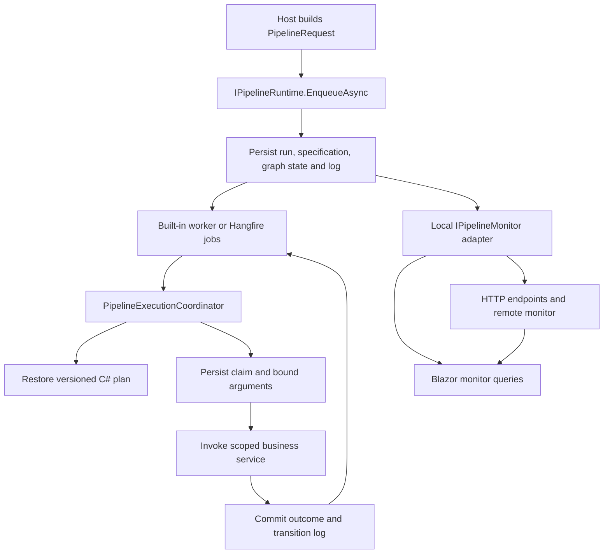

# Architecture

Pipeline is a C# workflow library with versioned graphs, persisted execution snapshots, selectable processors, and local or remote Blazor monitoring. These guides describe the 0.3.0 source reviewed on 2026-10-08, not generated site output.

| Project | Responsibility | Internal dependencies |
| --- | --- | --- |
| Pipeline.Core | Fluent graph validation, expressions, requests, typed output references, step context/logging contracts | None |
| Pipeline.Contracts | Monitoring interface, display enums, summaries, execution views | None |
| Pipeline.Runtime | Registration, restoration, submission, coordination, retry, local monitoring, in-memory stores, lifecycle events | Core, Contracts |
| Pipeline.Persistence.EntityFrameworkCore | SQL Server stores, schema, migrations, reset | Runtime |
| Pipeline.Hangfire | Background dispatch, delayed wake-ups, active-run recovery | Runtime |
| Pipeline.Blazor | Run list/detail pages, router, job components, ANSI logs | Contracts |
| Pipeline.AspNetCore | HTTP monitoring and retry endpoints | Contracts |
| Pipeline.HttpClient | Remote monitor and HTTP resilience configuration | Contracts |
| Pipeline.Web | Combined demo host, simulated directory services, employee provisioning | Selected executor, persistence, scheduler, and UI libraries |
| AspireApp1 | Separate renderer/executor and Kubernetes verification | Web: Blazor/HttpClient; API: Runtime/AspNetCore/Persistence |

See [solution membership](https://github.com/patware/Patware.Pipeline/blob/main/Pipeline.slnx) and [service registration](https://github.com/patware/Patware.Pipeline/blob/main/src/Pipeline.Runtime/PipelineServiceCollectionExtensions.cs). Build artifacts under `bin/` and `obj/` do not establish additional supported projects.

## Execution flow

Stored specifications contain definition ID/version and JSON input/settings, not executable expression trees. Compatible application code remains necessary for execution and detailed inspection.

`AddPipeline` can be called once. Its callback independently selects persistence and processing, then freezes. The default uses a singleton in-memory store and hosted worker. SQL Server adds library-owned startup migrations. Hangfire replaces the built-in worker and selects storage matching the persistence configuration.

The coordinator permits one live invocation per run. The singleton `PipelineOperationGate` also serializes gated operations across all runs in a process and remains held during business execution. Four Hangfire workers do not imply four concurrent business invocations in one host. Database revisions and leases protect cross-process state changes; external effects can still repeat after interruption.

Continue with [orchestration](PIPELINE-ORCHESTRATOR.md), [persistence](DATABASE.md), [recovery](RECONCILIATION.md), and [design decisions](../design/ADOPTION-DECISIONS.md).

See [distributed hosting](DISTRIBUTED-HOSTING.md) for protocol, replica requirements, and limits.
