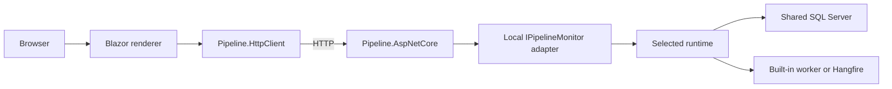

# Distributed hosting

Version 0.3.0 separates rendering from execution through transport-independent monitoring contracts. Both combined and separate-process hosting are supported.

## Library boundary



Pipeline.Contracts has no executor dependency. Blazor, AspNetCore, and HttpClient each reference Contracts. Runtime references Core and Contracts; Persistence and Hangfire reference Runtime.

The frontend sees summaries and display snapshots, not executable plans, revisions, leases, bound arguments, or outputs. Definition restoration stays in the backend.

## Executor registration

```csharp
using Pipeline.AspNetCore;
using Pipeline.Persistence.EntityFrameworkCore;
using Pipeline.Runtime;

builder.Services.AddPipeline(options =>
{
    options.UseSqlServer(connectionString);
});

// After builder.Build(), before app.Run():
app.MapPipelineEndpoints();
```

The built-in worker discovers active runs. UseHangfire may select the alternative processor in the same callback. Built-in steps and the log-formatting definition are automatic; application steps and all supported historical definition versions remain application registrations.

RunLogFormattingDemoOnStartup defaults to false. Enabling it submits one run per enabled host startup, not one run across a cluster.

## Renderer registration

```csharp
using Pipeline.Blazor;
using Pipeline.HttpClient;

// Register host-wide HTTP defaults first.
builder.Services.AddPipelineClient(new Uri("https://backend.example/"));

app.MapRazorComponents<App>()
    .AddPipelinePages()
    .AddInteractiveServerRenderMode();
```

Use PipelineRouter in Routes.razor to discover pipeline pages while keeping the host's Found fragment and layout. Remote renderers register no runtime or worker. Combined hosts use the local monitor provided by AddPipeline instead.

Aspire service defaults supply service discovery; after AddServiceDefaults, the sample client uses `https+http://apiservice`. Kubernetes supplies its logical service endpoint through configuration.

## HTTP protocol

| Route | Result |
| --- | --- |
| GET /api/pipeline/runs?skip=0&take=50 | Summaries with ordered jobs; no logs/step details. |
| GET /api/pipeline/runs/{runId:guid}/execution | Display snapshot, or 404. |
| POST /api/pipeline/runs/{runId:guid}/retry | 202 accepted, or 409 for missing/ineligible/concurrently changed runs. |

Paging requires nonnegative skip and take 1–100. Fixed web JSON options isolate the protocol from application serializer settings. Responses are no-store. Backend exceptions are logged and translated to generic problem responses.

The HTTP client maps missing execution to null and retry conflict to false. Other failures throw. Relative paths preserve a base-address application prefix. Automatic unsafe-method retries are disabled after inherited resilience handlers are removed; register global HTTP defaults before AddPipelineClient.

The protocol does not implement general-purpose submission, user cancellation, server push, durable events, or tenant authorization. Hosts configure authentication and authorization, including policies on the returned endpoint group.

## Replicas and recovery

Every executor replica must use the same durable store and compatible definitions. In-memory stores are independent per process.

Process-local operation gates serialize local work. Database revisions and renewable step leases coordinate stored state across replicas. The current step lease lasts two minutes and renews every twenty seconds. Recovery after interruption can wait for lease expiry and may repeat the step invocation.

Claims fence persisted results and logs; they cannot fence an arbitrary external service. Use stable idempotency keys and reconciliation for business side effects. Lifecycle notifications remain best-effort and process-local.

Multiple Blazor Server frontends require affinity for circuits and shared Data Protection keys. A pod failure may require a new circuit. SQL and Redis availability are separate deployment concerns.

## Current costs and verification

Overview payloads are smaller, but LocalPipelineMonitor still reads execution snapshots per run on the backend. Detail responses include full logs. This release does not add optimized read projections or server-side log paging.

The Aspire integration test covers separate processes and initial server rendering. The maintainer reported Docker Desktop Kubernetes validation with submissions through both API replicas and continued operation during API pod interruption. Persisted invocation logs are needed to establish that a specific running step was recovered by another worker.

See [Kubernetes setup and checks](../development/KUBERNETES.md), [recovery](RECONCILIATION.md), and [testing limits](../development/TESTING.md).
