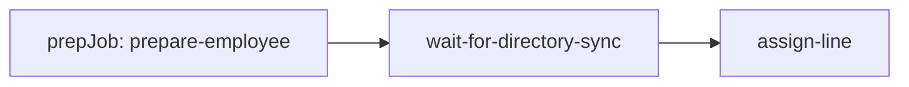

# Execution model

A definition identifies a workflow; a request supplies a plan and serialized data; a run is one submitted execution. Jobs express dependencies and optional conditions. Steps execute in registration order inside each job.

| Kind | Fluent entry | Result |
| --- | --- | --- |
| Command | `Step<T>().Execute(...)` | Await `Task`; no output |
| Producer | `Step<T>().Produces(...)` | Await `Task<T>`; store JSON output |
| Poll | `Poll<T>().Check(...)` | Await `Task<bool>`; false waits, true succeeds |

`After` establishes prerequisites, not parallel execution. The coordinator scans jobs in plan order and selects one eligible invocation. A waiting poll allows other eligible jobs to be considered on later passes.

`When(output, predicate)` evaluates after prerequisites are satisfied. False marks the job `ConditionSkipped`. A downstream dependency accepts that state only with `allowConditionSkipped: true`. Accepting a skipped job does not create outputs for unexecuted steps.

## Demo workflow

The [employee definition](https://github.com/patware/Patware.Pipeline/blob/main/src/Pipeline.Web/Pipelines/AssignLineEmployeeDefinition.cs), `AssignLineOrgEmployee` version 1, contains:

Preparation produces `RequiresDirectorySync`. When true, the waiting job polls for a phone-system license every minute for up to 30 minutes. The assignment job accepts a condition-skipped wait, assigns the phone number and calling policy, then checks enterprise voice every five seconds for up to ten minutes.

The host maps directory, Graph, and Teams interfaces to one singleton [DirectorySimulator](https://github.com/patware/Patware.Pipeline/blob/main/src/Pipeline.Web/Services/Fakes/DirectorySimulator.cs). These are simulated integrations. Other operations in [MyPipelines](https://github.com/patware/Patware.Pipeline/blob/main/src/Pipeline.Web/Services/MyPipelines.cs) still throw `NotImplementedException`.

See [states](STATE-MACHINES.md) and [polling](WAITS-AND-APPROVALS.md) for timing and failure semantics.
